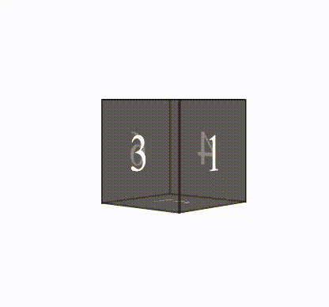

# 
Hi 👋 I'm an expert on React Js 👨‍💻 Next JS

- A beautiful 3D loader designed with HTML and CSS

>### Languages
>> 
>> 
>> 

## View of the  Mini-project

check this [URL](https://khadem-mh.github.io/loader3D/) for visit this page

___
>### Social Network
> 
> 
> 
> 
> 
